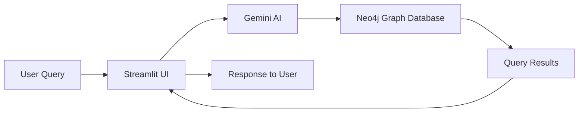

# 🎵 Melodia - Music Graph Chatbot

Melodia - A sophisticated AI-powered chatbot that leverages the Neo4j graph database and Google Gemini AI to provide intelligent insights about music artists, albums, and songs through natural language queries.

<p align="center">
  
  
  
  
  
  
</p>

---

## ✨ Features

| Feature                  | Description                                                  |
| ------------------------ | ------------------------------------------------------------ |
| Natural Language Queries | Ask questions about music in plain English                   |
| Graph Database Powered   | Built on Neo4j for efficient relationship queries            |
| AI-Powered Insights      | Utilizes Google Gemini for intelligent response generation   |
| Conversation Memory      | Remembers previous interactions for contextual conversations |
| Real-time Music Analysis | Query artists, genres, albums, and song attributes           |
| Beautiful UI             | Streamlit-based interface with music-themed styling          |
| Example Queries          | Quick-start with pre-built question templates                |
| Audio Feature Analysis   | Explore danceability, energy, tempo, and other audio metrics |

---

## 🏗️ Architecture



- **User Query** → **Streamlit App** → **Gemini AI** → **Neo4j Graph DB** → **Response**
- Conversation memory and context are maintained throughout the session.

---

## 📦 Installation

### Prerequisites

- Python 3.8+
- Neo4j Database (local or cloud)
- Google Gemini API Key

### Setup Steps

1. **Clone the repository**

   ```bash
   git clone https://github.com/nasifayc/Melodia
   cd music-graph-chatbot
   ```

2. **Create a virtual environment**

   ```bash
   python -m venv venv
   # On Windows:
   venv\Scripts\activate
   # On Mac/Linux:
   source venv/bin/activate
   ```

3. **Install dependencies**

   ```bash
   pip install -r requirements.txt
   ```

4. **Configure environment variables**

   Create a `config.py` file in the project root:

   ```python
   NEO4J_URI = "bolt://localhost:7687"
   NEO4J_USERNAME = "neo4j"
   NEO4J_PASSWORD = "your_neo4j_password"
   GEMINI_API_KEY = "your_gemini_api_key_here"
   DATA_FILE = "spotify_songs.csv"
   ```

5. **Load music data (First-time setup)**

   ```bash
   python create_data_loader.py
   ```

6. **Launch the application**
   ```bash
   streamlit run app.py
   ```

---

## 🎯 Usage Examples

| Query Type          | Example Query                                  |
| ------------------- | ---------------------------------------------- |
| Artist Insights     | "What are the most popular songs by Queen?"    |
| Genre Exploration   | "List artists in the 'pop' genre"              |
| Audio Features      | "Show me high-energy dance songs"              |
| Temporal Queries    | "Which albums were released in 2019?"          |
| Collaborations      | "Find collaborations between artists"          |
| Popularity Analysis | "Top 5 most popular songs overall"             |
| Music Discovery     | "Find songs with high danceability and energy" |

---

## 🗂️ Project Structure

```
music-graph-chatbot/
├── app.py                  # Main Streamlit application
├── create_data_loader.py   # Data loading and Neo4j setup
├── database/
│   ├── __init__.py         # Package initialization
│   ├── loader.py           # Neo4j data loader
│   └── schema.py           # Database schema setup
├── config.py               # Configuration and credentials
├── requirements.txt        # Python dependencies
├── spotify_songs.csv       # Music dataset (28k+ songs)
└── README.md               # This file
```

---

## 🔧 Configuration

| Variable       | Description                   | Example                  |
| -------------- | ----------------------------- | ------------------------ |
| NEO4J_URI      | Neo4j database connection URI | bolt://localhost:7687    |
| NEO4J_USERNAME | Neo4j username                | neo4j                    |
| NEO4J_PASSWORD | Neo4j password                | your_neo4j_password      |
| GEMINI_API_KEY | Google Gemini API key         | your_gemini_api_key_here |
| DATA_FILE      | Path to music data CSV        | spotify_songs.csv        |

---

## 🗃️ Data Schema

- **Track Metadata**: ID, name, artist, album, popularity
- **Audio Features**: danceability, energy, tempo, valence, loudness
- **Genre Information**: playlist_genre, playlist_subgenre
- **Temporal Data**: release_date, duration_ms
- **Technical Attributes**: key, mode, speechiness, acousticness

**Graph Model:**

- `(:Artist)-[:SINGS]->(:Song)`
- `(:Album)-[:CONTAINS]->(:Song)`
- `(:Artist)-[:CREATED]->(:Album)`

---

## 📊 Dataset Information

- **Songs:** 28,352 across multiple genres
- **Artists:** 10,692 unique
- **Albums:** 22,543
- **Genres:** pop, rap, rock, latin, r&b, edm
- **Rich audio features for music analysis**

---

## 🚀 Performance

| Metric            | Value                                |
| ----------------- | ------------------------------------ |
| Response Time     | < 3 seconds for most queries         |
| Database Scale    | 60,000+ nodes, 80,000+ relationships |
| Memory Efficiency | Optimized session state management   |
| Concurrent Users  | Streamlit supports multiple users    |

---

## 🛠️ Dependencies

| Package                | Version |
| ---------------------- | ------- |
| streamlit              | 1.28.0  |
| langchain              | 0.0.346 |
| langchain-community    | 0.0.19  |
| langchain-google-genai | 0.0.8   |
| neo4j                  | 5.12.0  |
| pandas                 | 2.0.3   |
| google-generativeai    | 0.3.2   |
| python-dotenv          | 1.0.0   |

---

## 🤝 Contributing

We welcome contributions! Please feel free to submit pull requests for:

- New query capabilities
- Additional data sources
- UI/UX improvements
- Performance optimizations
- Documentation enhancements

**Development Setup:**

1. Fork the repository
2. Create a feature branch
3. Make your changes
4. Test thoroughly
5. Submit a pull request

---

## 📄 License

This project is licensed under the MIT License - see the LICENSE file for details.

---

## 🙏 Acknowledgments

- **Kaggle Dataset:** For providing the music dataset
- **Neo4j:** For the powerful graph database platform
- **Google:** For the Gemini AI language model
- **Streamlit:** For the excellent web application framework
- **LangChain:** For the AI framework integration

---

## 📞 Support & Troubleshooting

- **Neo4j Connection Failed:**
  - Verify Neo4j is running
  - Check connection credentials in `config.py`
- **Gemini API Error:**
  - Validate API key is correct
  - Check Gemini API quota limits
- **Data Loading Issues:**
  - Ensure `spotify_songs.csv` is in project root
  - Run `python create_data_loader.py` to reload data
- **Performance Tips:**
  - Use specific queries for faster responses
  - Limit result sets when possible
  - Utilize the conversation memory for follow-up questions

> **Note:** This application is for educational and demonstration purposes. Ensure you have proper licenses for commercial use of the data and APIs.

---
